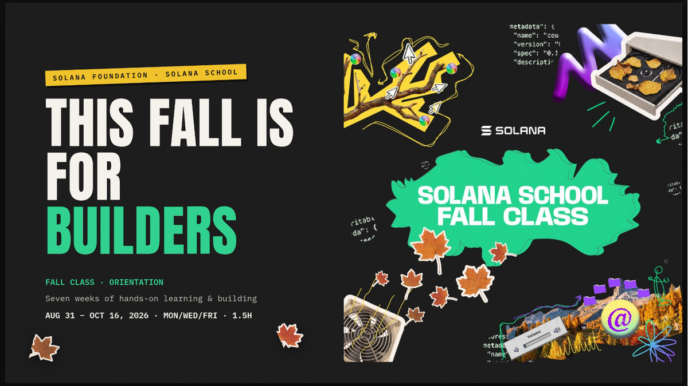

# Solana School: Fall Class 2026

[](https://luma.com/jy1g8k90)

Official Solana School course artwork. [Course event page](https://luma.com/jy1g8k90).

Unofficial technical notes, verified references, and runnable Solana programs from Solana School Fall 2026.

This repository is not maintained by Solana Foundation and does not replace the [official Solana documentation](https://solana.com/docs). Each session is reduced to technical notes, useful commands, and reproducible code.

## Course

[Solana School: Fall Class](https://luma.com/jy1g8k90) runs from August 31 through October 16, 2026.

## Sessions

| Session | Topics | Notes | Lab | Visuals |
| --- | --- | --- | --- | --- |
| 01 | SVM, accounts, transactions, PDAs, Anchor setup | [Notes](docs/session-01/README.md) | [hello-solana](labs/session-01/hello-solana/README.md) | [SVM blueprint](assets/session-01/solana-svm-blueprint.pdf) and [video](media/session-01/README.md) |
| 02 | TBD |  |  |  |

## Repository structure

```text
docs/
  session-01/       Public technical notes, commands, homework, and references
labs/
  session-01/       Runnable programs and experiments
media/
  session-01/       Metadata and links for externally hosted media
assets/
  session-01/       Original diagrams and visual study material
```

Future sessions use the same `docs/session-NN` and `labs/session-NN` convention.

## Current tested environment

The Session 1 lab was validated with:

| Tool | Version |
| --- | --- |
| Rust | 1.89.0 project toolchain |
| Solana CLI | 2.3.0 (Agave) |
| Anchor CLI | 0.32.1 |
| Node.js | 24.10.0 |
| Yarn | 1.22.22 |

These versions describe the tested Session 1 lab. Later sessions may use a different toolchain. See the [lab compatibility note](labs/session-01/hello-solana/README.md#toolchain-compatibility).

## Licensing and provenance

- Original source code is available under the [MIT License](LICENSE-CODE).
- Original written material is available under [CC BY 4.0](LICENSE-CONTENT).
- Third-party course materials, trademarks, and linked documentation remain under their owners' terms and are not covered by these licenses.

See [DISCLAIMER.md](DISCLAIMER.md) for scope and provenance details.
